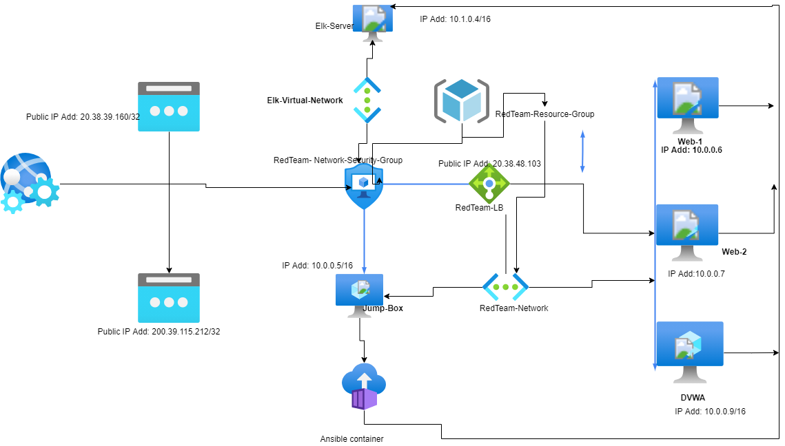

## Automated ELK Stack Deployment

The files in this repository were used to configure the network depicted below.

These files have been tested and used to generate a live ELK deployment on Azure. They can be used to either recreate the entire deployment pictured above. Alternatively, select portions of the /etc/ansible/filebeat-playbook.yml file may be used to install only certain pieces of it, such as Filebeat.

   Enter the playbook file._

This document contains the following details:
- Description of the Topology
- Access Policies
- ELK Configuration
- Beats in Use
- Machines Being Monitored
- How to Use the Ansible to build containers 

### Description of the Topology

The main purpose of this network is to expose a load-balanced and monitored instance of DVWA, the D*mn Vulnerable Web Application.

Load balancing ensures that the application will be highly reliable and available, in addition to restricting traffic to the network.
 
What aspect of security do load balancers protect?
AnS: Load balancers can detect and drop distributed denial of service (DDOS) traffic before it gets to the website or Servers 
 What is the advantage of a jump box?
 Ans: Jump-Box helps to harden network security and also provides the ability to manage other machines remotely within a network or security zone.

Integrating an ELK server allows users to easily monitor the vulnerable VMs for changes to logs and system traffic.
- _ What does Filebeat watch for?_
Ans: Filebeat monitors locations and log files, it also collects event log data and send the data Elasticsearch or Logstash.
- _ What does Metricbeat record?
Ans: Metribeat documents statistics and metric it collects and send them to an output file, that could be Elasticsearch or Logstash

The configuration details of each machine may be found below.
<!--_Note: Use the [Markdown Table Generator](http://www.tablesgenerator.com/markdown_tables) to add/remove values from the table_.-->

| Name     | Function | IP Address | Operating System |
|----------|----------|------------|------------------|
| Jump Box | Personal | 10.0.0.6   |  Linux           |
| Web-1    | private  | 10.0.0.7      Linux           |                  |
| Web-2    | Private  | 10.0.0.9      Linux           |                  |
| DVWA
Elk-Server |          |            |                  |

### Access Policies

The machines on the internal network are not exposed to the public Internet. 

Only the Jump-Box machine can accept connections from the Internet. Access to this machine is only allowed from the following IP addresses:
-IP addresses 215.37.38.171

Machines within the network can only be accessed by _____.
- Which machine did you allow to access your ELK VM? What was its IP address?_
The Web-1 VM have access to the ELK VM
_ IP Address: 10.0.0.6

A summary of the access policies in place can be found in the table below.

| Name     | Publicly Accessible | Allowed IP Addresses |
|----------|---------------------|----------------------|
| Jump Box | IP 215.37.38.171    | 10.0.0.6             |
| Web-1    | No                  | 10.0.0.7             |
| Web-2    | NO                  | 10.0.0.8             |
  ELK        No                    10.1.0.4

### Elk Configuration

Ansible was used to automate configuration of the ELK machine. No configuration was performed manually, which is advantageous because...
- _TODO: What is the main advantage of automating configuration with Ansible?_

The playbook implements the following tasks: 
In 3-5 bullets, explain the steps of the ELK installation play. E.g., install Docker; download image; etc._
- Install Docker
- Install python3-pip
- Install Docker pyhton module
- Increase memory
- Download and launch a docker elk container

The following screenshot displays the result of running `docker ps` after successfully configuring the ELK instance.

![TODO:   (Images/docker_ps_output.png)

### Target Machines & Beats
This ELK server is configured to monitor the following machines:
- Web-1 (10.0.0.6)
- Web-2 (10.0.0.7)
- Web-3 (10.0.0.8)
We have installed the following Beats on these machines:
- Filebeat
- Metribeat

These Beats allow us to collect the following information from each machine:
- Filebeat collect log events, which we use to track suspicious traffic on the monitored servers. 
- Metricbeat collect information about operating system and services which help to detect if a server is behaving suspiciously.

### Using the Playbook
In order to use the playbook, you will need to have an Ansible control node already configured. Assuming you have such a control node provisioned: 

SSH into the control node and follow the steps below:
- Copy the ansible.config file to the /etc/ansible.
- Update the ansible.cfg file to include the IP address of the host
- Run the playbook, and navigate to http://40.87.109.74:5601/app/kibana to check that the installation worked as expected.

 Answer the following questions to fill in the blanks:_
- _Which file is the playbook? Where do you copy it?_
  Ans: Filebeat is saved in the /etc/ansible/filebeat-playbook.yml, and it is copied to /etc/ansible/filebeat
- _Which file do you update to make Ansible run the playbook on a specific machine? How do I specify which machine to install the ELK server on versus which to install Filebeat on?_
Ans: Update the /etc/ansible/filebeat-playbook.yml and add the machine name and private IP address in the playbook.config file 
- _Which URL do you navigate to in order to check that the ELK server is running?
Ans: http://40.87.109.74:5601/app/kibana

_As a **Bonus**, provide the specific commands the user will need to run to download the playbook, update the files, etc._
Ans: ansible-playbook install-elk.yml to run playbook
nano install-elk.yml to update the playbook